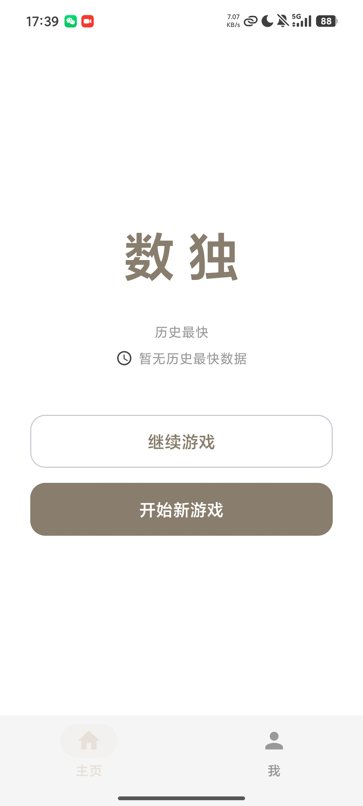
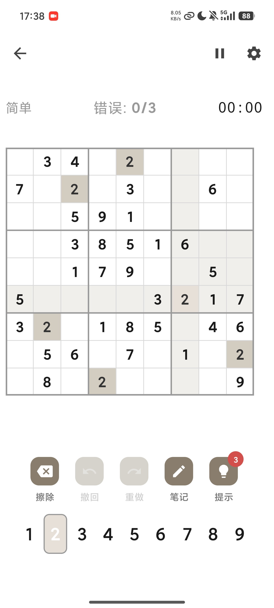
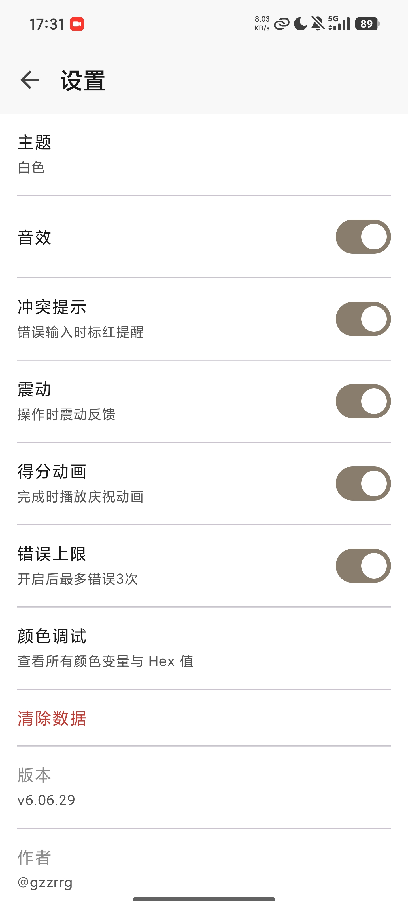
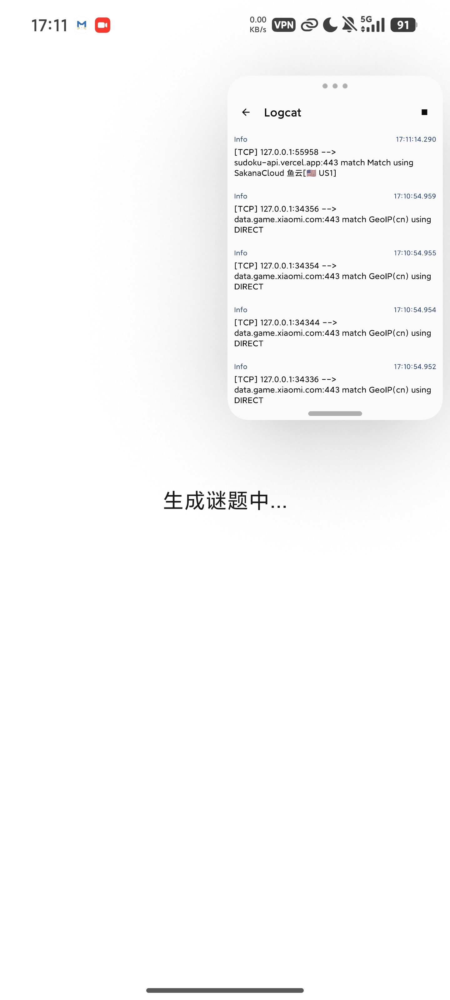
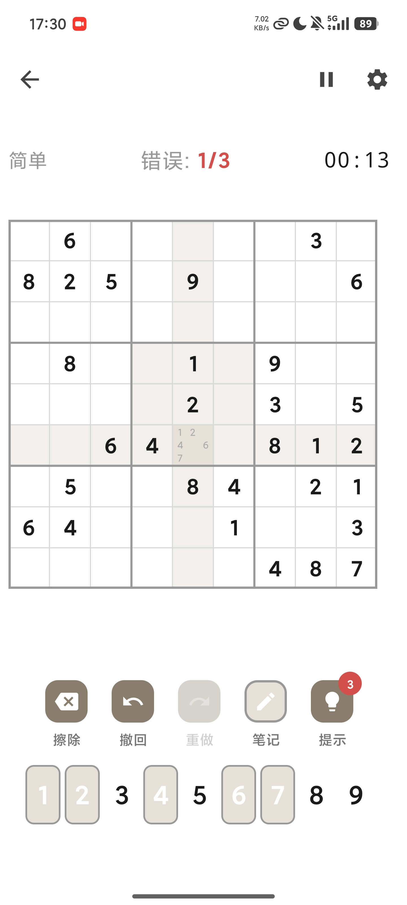
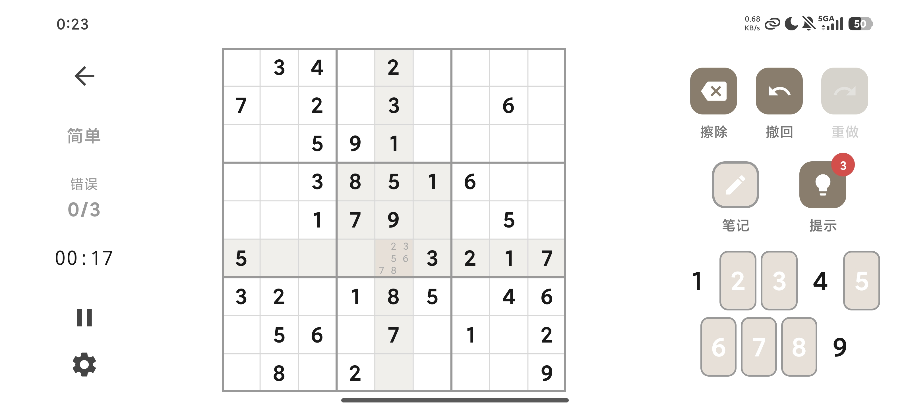

<p align="center">
  <a href="../README.md">🇨🇳 中文</a>
  &nbsp;|&nbsp;
  <a href="README_EN.md">🇬🇧 English</a>
</p>

<p align="center">
  
  
  
  
  
</p>

<p align="center">
  
</p>

<h1 align="center">Sudoku · 数独</h1>

<p align="center">
  <b>一款功能丰富的现代 Android 数独游戏。</b><br>
  Jetpack Compose + Material 3 构建 · MVVM 架构 · 离线可用
</p>

---

## 截图

<p align="center">
  
  
  
</p>

## 功能特性

### 核心玩法

- **三级难度** — 简单（38–42 个提示数）、中等（28–32）、困难（22–26）。每道谜题保证唯一解。

- **远程谜题 + 离线降级** — 默认从 dosuku API 获取谜题，网络不可用时自动切换至内置回溯法生成——随时随地都能玩。

  <p align="center">
    
  </p>

- **笔记模式** — 点击笔记按钮进入候选数标记模式。每格以 3×3 子网格布局显示候选数字，数字键盘同步高亮已标记的数字，方便追踪推理过程。

  <p align="center">
    
  </p>

- **撤销 / 重做** — 完整操作历史，不限步数。每次操作（填入数字、修改笔记）均被记录，随时回退。

### 辅助与反馈

- **提示系统** — 每局 3 次提示。按下提示按钮，当前选中的空格即被填入正确答案。工具栏角标显示剩余提示次数。

- **冲突检测** — 不合法填数实时高亮显示，以醒目的错误颜色标注。可在设置中开启或关闭冲突提示。

- **错误限制** — 累计 3 次错误游戏结束（可在设置中关闭）。关闭后可享受无压力的休闲体验。

  <p align="center">
    
    
  </p>

### 进度与数据

- **自动存档** — 每次操作自动保存至本地 Room 数据库。关闭应用、切换任务或重启手机——游戏进度始终保留。

- **实时计时** — 秒级精度计时，离开游戏页面自动暂停，返回自动恢复。

- **数据统计面板** — 按难度展示：游戏数、获胜数、胜率、零错误获胜、连胜、最佳用时、平均用时。Canvas 柱状图直观呈现你的进步。

  <p align="center">
    
  </p>

### 视觉设计

- **三套完整主题** — 所有组件在三套主题下完整适配。随时切换，也支持跟随系统设置。

  <p align="center">
    
    
    
  </p>

  | 主题 | 底色 | 主色 | 棋盘底色 | 网格线 | 选中色 | 适用场景 |
  |------|------|------|----------|--------|--------|----------|
  | 浅色（护眼绿） | `#DFECD1` | `#8CB85C` | `#F7FAF2` | `#5D6A52` | `#8CB85C` | 日常使用 |
  | 深色 | `#1C1C1E` | `#8DC563` | `#2C2C2E` | `#636366` | `#8DC563` | 夜间使用 |
  | 白色 | `#FFFFFF` | `#8B7D6B` | `#F5F5F5` | `#999999` | `#E8E0D8` | 极简风格 |

- **响应式布局** — 手机竖屏采用单栏布局，旋转至横屏或使用平板时自动切换为双栏布局（棋盘 65% + 控制区 35%）。

  <p align="center">
    
    
  </p>

## 技术架构

```
┌─────────────────────────────────────────────┐
│  UI 层 (Jetpack Compose)                    │
│  HomeScreen / GameScreen / SettingsScreen   │
│         ↕ StateFlow                         │
│  ViewModel (HomeVM / GameVM / ProfileVM)    │
│         ↕                                   │
│  Repository (SudokuRepository)              │
│    ↙        ↓         ↘                    │
│  Room     DataStore    Retrofit             │
│ (存档)   (偏好设置)    (远程API)              │
└─────────────────────────────────────────────┘
```

| 类别 | 技术 |
|------|------|
| 语言 | Kotlin 2.2.10 |
| UI | Jetpack Compose + Material 3（BOM 2026.02.01） |
| 架构 | MVVM + Repository（手动 DI，通过 `AppContainer`） |
| 数据库 | Room（游戏存档 + 历史记录） |
| 偏好存储 | DataStore（主题、音效、难度、统计数据） |
| 网络 | Retrofit 2 + Gson |
| 导航 | Compose Navigation |
| 异步 | Kotlin Coroutines + StateFlow |
| 构建系统 | Gradle 9.4.1 + AGP 9.2.1 + KSP |
| 最低/目标 SDK | Android 16 (API 36) |

```
com.zir.sudoku/
├── di/AppContainer.kt              # 手动 DI 容器
├── data/
│   ├── local/                      # Room 数据库、DAO、实体、DataStore
│   ├── remote/                     # Retrofit API 接口
│   └── repository/                 # 统一数据访问 + 离线降级逻辑
├── domain/
│   ├── model/                      # BoardState、Cell、Difficulty、Operation
│   └── engine/                     # SudokuGenerator、SudokuValidator
└── ui/
    ├── navigation/NavGraph.kt      # 路由定义
    ├── screen/
    │   ├── home/                   # 首页 + ViewModel
    │   ├── game/                   # 游戏页 + 组件
    │   ├── profile/                # 数据统计面板
    │   └── settings/               # 设置页
    └── theme/                      # 调色板、主题、排版
```

## 构建与运行

**环境要求：** Android Studio（最新稳定版）、Android SDK 36、JDK 11+

```bash
git clone https://github.com/gzzrrg/Sudoku.git
cd Sudoku

./gradlew assembleDebug      # Debug 构建
./gradlew installDebug       # 安装到已连接设备
./gradlew test               # 单元测试
./gradlew lint               # 代码 Lint 检查
```

## 许可

MIT License © [@gzzrrg](https://github.com/gzzrrg)
