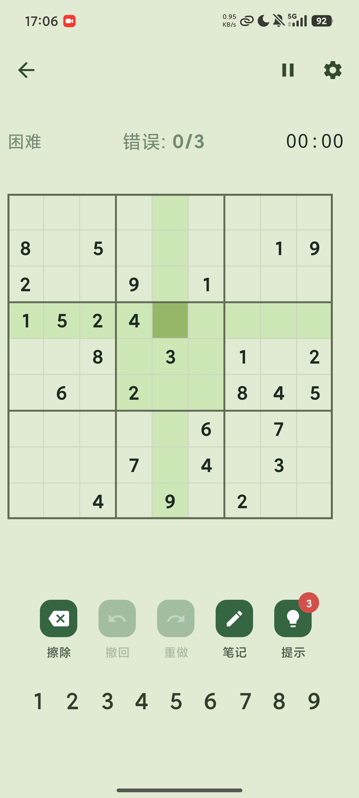
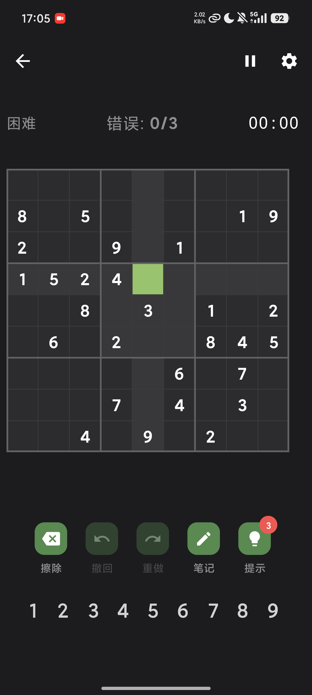
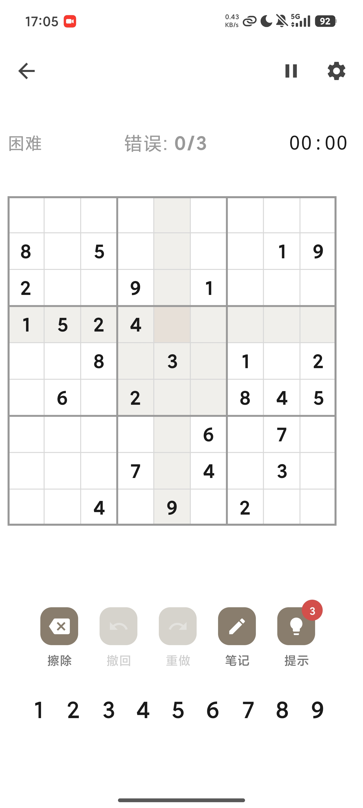
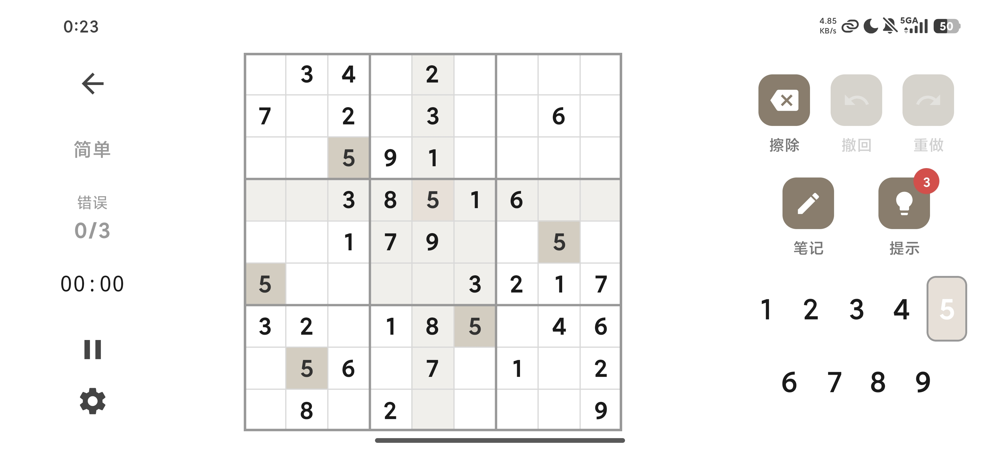
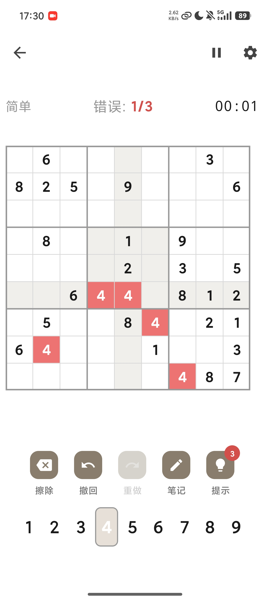
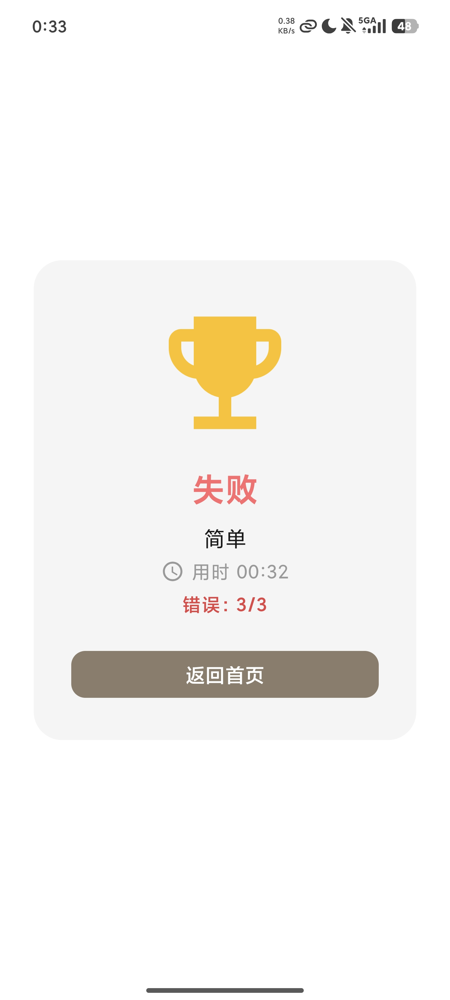
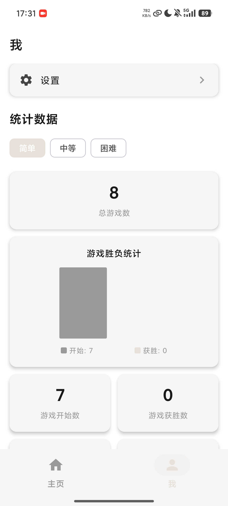

<p align="center">
  <a href="../README.md"></a>
  <a href="README_EN.md"></a>
</p>

<p align="center">
  
  
  
  
  
</p>

<p align="center">
  
</p>

<h1 align="center">Sudoku · 数独</h1>

<p align="center">
  <b>Ad-free · No subscriptions · Pure Sudoku experience</b><br>
  Jetpack Compose + Material 3 · MVVM Architecture
</p>

---

## Background

As a Sudoku enthusiast, I often play Sudoku on my phone. However, apps on the store are either plagued by ads or require a paid membership to remove them. So I decided to build my own — a clean, ad-free, completely free, and fully-featured Sudoku game.

## Overview

Sudoku is a modern Android Sudoku app built with Kotlin and Jetpack Compose. Puzzles are fetched from the dosuku API by default; when the request times out or the network is unavailable, it automatically falls back to a local backtracking generator. It offers three difficulty levels, pencil marks, undo/redo, hints, real-time timing, and statistics.

## Puzzle Generation

The game prioritizes the [dosuku API](https://sudoku-api.vercel.app/api/dosuku) for fetching puzzles.

```
GET https://sudoku-api.vercel.app/api/dosuku
```

The API returns JSON containing a 9×9 puzzle (`value`) and its solution (`solution`). On timeout or failure, it falls back to the local backtracking generator, which creates puzzles at the selected difficulty.

| Difficulty | Givens | Blanks |
|------------|--------|--------|
| Easy | 38–42 | 39–43 |
| Medium | 28–32 | 49–53 |
| Hard | 22–26 | 55–59 |

Every puzzle is guaranteed to have a unique solution.

## Screens

### Themes

Three complete themes. Every component adapts across all three, with support for following the system preference.

<p align="center">
  
  
  
</p>

### Responsive Layout

Single-column layout on phones in portrait mode. Rotate to landscape or use a tablet, and the UI switches to a dual-pane layout (board 65% + controls 35%), making full use of the screen.

<p align="center">
  
</p>

## Features

### Core Gameplay

- **Three difficulties** — Easy, Medium, and Hard, each puzzle guaranteed a unique solution.
- **Remote puzzles + offline fallback** — Fetched from the dosuku API by default, with local generation on failure.
- **Pencil marks** — Candidate numbers displayed in a clean 3×3 sub-grid per cell.
- **Undo / Redo** — Unlimited history for every action.

### Assistance & Feedback

- **Hints** — 3 hints per game, with a remaining count badge on the toolbar.
- **Conflict detection** — Invalid placements highlighted in real time (toggleable).
- **Error limit** — Game ends after 3 mistakes (toggleable).

  <p align="center">
    
    
  </p>

### Progress & Data

- **Auto-save** — Every move persisted to the local Room database.
- **Real-time timer** — Second-level precision, auto-pauses when leaving the game.
- **Statistics** — Per-difficulty stats: games played, wins, win rate, streaks, best times.

  <p align="center">
    
  </p>

## Architecture

```
┌─────────────────────────────────────────────┐
│  UI Layer (Jetpack Compose)                 │
│  HomeScreen / GameScreen / SettingsScreen   │
│         ↕ StateFlow                         │
│  ViewModel (HomeVM / GameVM / ProfileVM)    │
│         ↕                                   │
│  Repository (SudokuRepository)              │
│    ↙        ↓         ↘                    │
│  Room     DataStore    Retrofit             │
│ (saves)  (prefs)      (remote API)          │
└─────────────────────────────────────────────┘
```

| Category | Technology |
|----------|------------|
| Language | Kotlin 2.2.10 |
| UI | Jetpack Compose + Material 3 (BOM 2026.02.01) |
| Architecture | MVVM + Repository (manual DI) |
| Database | Room (game sessions + history) |
| Preferences | DataStore (theme, difficulty, stats) |
| Networking | Retrofit 2 + Gson |
| Navigation | Compose Navigation |
| Async | Kotlin Coroutines + StateFlow |
| Build System | Gradle 9.4.1 + AGP 9.2.1 + KSP |
| Min / Target SDK | Android 16 (API 36) |

```
com.zir.sudoku/
├── di/AppContainer.kt              # Manual DI container
├── data/
│   ├── local/                      # Room database, DAOs, entities, DataStore
│   ├── remote/                     # Retrofit API service
│   └── repository/                 # Unified data access + offline fallback
├── domain/
│   ├── model/                      # BoardState, Cell, Difficulty, Operation
│   └── engine/                     # SudokuGenerator, SudokuValidator
└── ui/
    ├── navigation/NavGraph.kt      # Route definitions
    ├── screen/
    │   ├── home/                   # Home screen + ViewModel
    │   ├── game/                   # Game screen + components
    │   ├── profile/                # Statistics dashboard
    │   └── settings/               # Settings screen
    └── theme/                      # Color palettes, Theme, Typography
```

## Build & Run

**Prerequisites:** Android Studio (latest stable), Android SDK 36, JDK 11+

```bash
git clone https://github.com/gzzrrg/Sudoku.git
cd Sudoku

./gradlew assembleDebug      # Debug build
./gradlew installDebug       # Install to connected device
./gradlew test               # Unit tests
./gradlew lint               # Lint checks
```

## License

MIT License © [@gzzrrg](https://github.com/gzzrrg)
